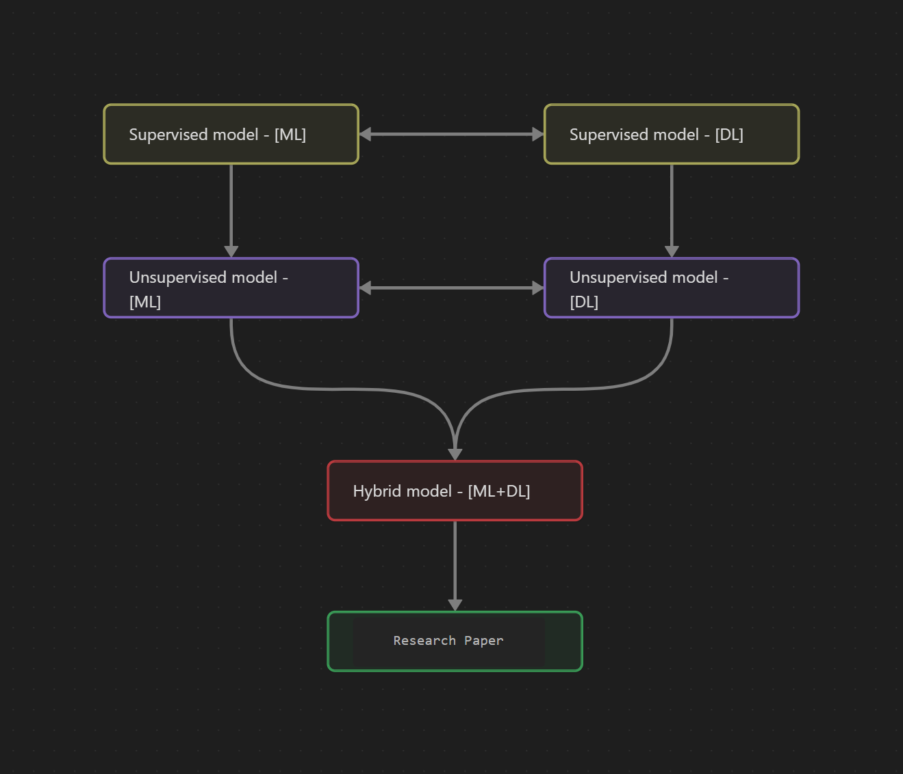

# Intrusion Detection Hybrid

This repository houses an intrusion detection system (IDS) built using a hybrid model approach, combining both supervised and unsupervised techniques for enhanced accuracy and adaptability. The system is designed to analyze network traffic data to detect and mitigate potential intrusions and security threats.

## Project Flow

## Features

- **Hybrid Model:** Integrates supervised and unsupervised learning techniques for improved intrusion detection capabilities.
- **Network Traffic Analysis:** Analyzes network traffic data to identify suspicious activities and potential intrusions.
- **Scalable Architecture:** Designed to handle large-scale network datasets efficiently.
- **Customizable:** Modular design allows easy customization and extension to fit various network environments and security requirements.
- **Real-time Monitoring:** Provides real-time monitoring of network traffic to detect and respond to intrusions promptly.

## Usage

1. Clone the repository to your local environment.
2. Follow the setup instructions provided in the documentation.
3. Run the provided scripts to preprocess data, train models, and deploy the intrusion detection system.
4. Monitor network traffic and analyze detected intrusions using the provided tools and visualizations.

## Contributing

Contributions to this repository are welcome! Whether it's bug fixes, feature enhancements, or new ideas, feel free to contribute by submitting pull requests or opening issues.

## License

This project is licensed under the [MIT License](#), allowing for both personal and commercial use with proper attribution.

## Credits

This project was developed by myself Mansi Singh and is maintained by me only.
